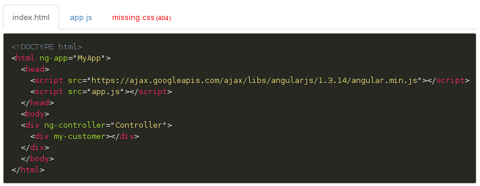

# angular-snippets

Angular directives to display code.
 
- Use [Prism](http://prismjs.com/) syntax highlighter
- Fully configurable by templates and css

## Example

    <snippets path="snippets/demo" files="['index.html', 'app.js', 'missing.css']">
      <pane snippet="{name: 'run', icon: 'fa-cog'}"><iframe src="snippets/demo/index.html"></iframe></pane>
    </snippets>

# Legal

The source for angular-snippets is released under the GNU General Public License as published by the Free Software Foundation, either version 3 of the License, or (at your option) any later version.
