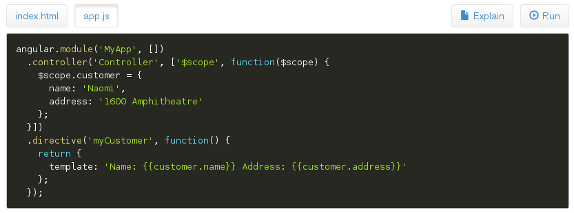

# angular-snippets

[![NPM version][npm-image]][npm-url] [![Build Status][travis-image]][travis-url]

[Project page](http://jbdemonte.github.io/angular-snippets/)

Angular directives to display code.
 
- Use [Prism](http://prismjs.com/) syntax highlighter
- Fully configurable by themes
- Load file from attribute list or using JSON manifest

## Examples

### Using file list in attribute and bootstrap-tabs theme 

    <snippets path="snippets/demo" files="['index.html', 'app.js', 'missing.css']"></snippets>

### Using manifest and bootstrap-buttons theme 

    <snippets path="snippets/demo1/">
      <snippets-pane snippet="{name: 'Explain', selected: true, cls:'pull-right', icon: 'glyphicon glyphicon-file'}">
        

          ...
        

      </snippets-pane>
    </snippets>

# Legal

The source for angular-snippets is released under the GNU General Public License as published by the Free Software Foundation, either version 3 of the License, or (at your option) any later version.

[npm-url]: https://npmjs.org/package/angular-snippets
[npm-image]: https://badge.fury.io/js/angular-snippets.png

[travis-url]: http://travis-ci.org/jbdemonte/angular-snippets
[travis-image]: https://secure.travis-ci.org/jbdemonte/angular-snippets.png?branch=master